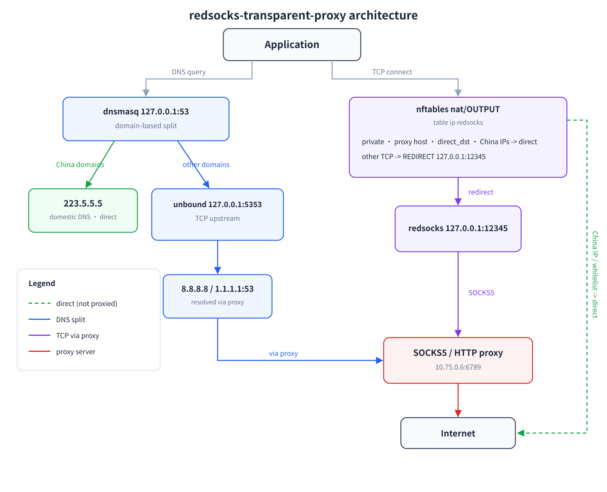

# redsocks-transparent-proxy

Transparent split routing for a **Linux server in mainland China**:

- **Overseas** (non-China) TCP traffic goes through a SOCKS5/HTTP proxy
- **China** traffic stays direct (fast, uses domestic CDN)
- **DNS is split by domain**: China domains resolve via a domestic DNS directly,
  everything else is resolved through the proxy over **TCP**, defeating DNS poisoning

Built on `redsocks` + `nftables` + `dnsmasq` + `unbound`. No application config changes.

## How it works



> Source: [`docs/architecture.svg`](docs/architecture.svg) (中文) / [`docs/architecture.en.svg`](docs/architecture.en.svg);
> regenerate with `python3 docs/architecture.py`, then
> `rsvg-convert -z 2 -o docs/architecture.en.png docs/architecture.en.svg`.

```
app
 ├─ DNS → 127.0.0.1:53 (dnsmasq)
 │         ├─ China domains (110k list + .cn) ──→ 223.5.5.5  (UDP, direct)
 │         └─ everything else ──→ 127.0.0.1:5353 (unbound)
 │                                      └─ upstream TCP 8.8.8.8/1.1.1.1:53 (proxied)
 └─ TCP
       ▼
   nftables (nat/OUTPUT, table ip redsocks)
     ├─ private/reserved, proxy host, direct whitelist, China IPs → RETURN (direct)
     └─ other TCP → REDIRECT 127.0.0.1:12345 → redsocks → SOCKS5/HTTP proxy
```

> unbound's TCP upstream also matches the last rule, so it is proxied and cannot be poisoned.

## Requirements

- Debian 12/13 or Ubuntu 22.04+ (systemd, nftables, python3, curl)
- root
- a working SOCKS5 / HTTP proxy. Test it first:
  `curl -x socks5h://HOST:PORT -sI https://www.google.com`

## Install

Clone:

```bash
git clone https://github.com/chenxianlong/redsocks-transparent-proxy
sudo bash redsocks-transparent-proxy/scripts/install.sh --proxy HOST:PORT
```

One-liner (no clone):

```bash
curl -fsSL https://raw.githubusercontent.com/chenxianlong/redsocks-transparent-proxy/main/install.sh \
  | sudo bash -s -- --proxy HOST:PORT
```

> If `raw.githubusercontent.com` is blocked on your network, clone the repo through
> a proxy or a mirror first, then run `scripts/install.sh`.

### Options

| Option | Description | Default |
| --- | --- | --- |
| `--proxy HOST:PORT` | proxy address (required) | - |
| `--type` | `socks5` \| `socks4` \| `http-connect` \| `http-relay` | `socks5` |
| `--user` / `--pass` | proxy credentials | none |
| `--direct-dns` | domestic DNS | `223.5.5.5` |
| `--remote-dns` / `--remote-dns2` | foreign DNS, queried over TCP via the proxy | `8.8.8.8` / `1.1.1.1` |
| `--no-dns-split` | route *all* DNS through the proxy | off |
| `--allowlist` | only proxy IPs in `not_cn.txt` (default is China-bypass) | off |
| `--gateway` | also forward for the LAN (`ip_forward` + `nat/prerouting`) | off |
| `--port` | redsocks local port | `12345` |

```bash
# typical
sudo bash scripts/install.sh --proxy 10.0.0.1:1080 --yes

# with auth
sudo bash scripts/install.sh --proxy 10.0.0.1:1080 --user me --pass secret

# also act as a gateway for the LAN
sudo bash scripts/install.sh --proxy 10.0.0.1:1080 --gateway
```

## Verify

```bash
curl -s -o /dev/null -w 'google: %{http_code}\n' https://www.google.com   # 200
curl -s -o /dev/null -w 'baidu : %{http_code} %{time_total}\n' https://www.baidu.com

dig +short @127.0.0.1 www.baidu.com      # domestic answer
dig +short @223.5.5.5 www.google.com     # poisoned / fake IP
dig +short @127.0.0.1 www.google.com     # real IP

sudo redsocks-nft show
```

## Gateway mode (experimental)

With `--gateway`:

- `net.ipv4.ip_forward=1` (persisted in `/etc/sysctl.d/99-redsocks-transparent-proxy.conf`)
- an extra `nat/prerouting` chain redirects forwarded non-China TCP to redsocks
- `redsocks` binds `0.0.0.0`; `dnsmasq`/`unbound` also listen on the LAN IP
- on the other machines, set **default gateway** and **DNS** to this server's LAN IP
- make sure your firewall/security group allows `FORWARD`

## Performance

- **China traffic**: only one extra in-kernel nftables set lookup (rbtree, ~ns);
  measured redsocks **CPU 0.0 ms**, line-rate throughput.
- **Overseas traffic**: redsocks relays with `splice()`. Measured ~4.5% of one core
  at 200 Mbps; a single core roughly handles 2–4 Gbps.
- **Cost**: first overseas DNS lookup 200–400 ms (0 ms once cached); redsocks is
  single-threaded, so CPU can cap very high bandwidth.
- **Concurrency**: `redsocks_conn_max` defaults to only **128** (systemd caps
  `LimitNOFILESoft` at 1024); the installer now sets **8192** (`--conn-max`).

See [docs/performance.md](docs/performance.md) for numbers and how to reproduce.

## Maintenance

```bash
sudo redsocks-refresh            # refresh China IP list + China domain list
sudo redsocks-refresh-domains    # refresh China domain list only
sudoedit /etc/redsocks/direct_dst.txt && sudo systemctl restart redsocks-nft
```

## Uninstall

```bash
sudo bash scripts/uninstall.sh           # keep packages
sudo bash scripts/uninstall.sh --purge   # also remove redsocks/unbound/dnsmasq
```

## Use as an Agent Skill

This repo is also an [Agent Skills](https://agentskills.io/specification) package
(entry point [`SKILL.md`](SKILL.md)). Install it with:

```bash
git clone https://github.com/chenxianlong/redsocks-transparent-proxy ~/.agents/skills/redsocks-transparent-proxy
# or ~/.pi/agent/skills/ , ~/.claude/skills/
```

## Important pitfalls

1. **Do not use redsocks `redudp` with a clash/mihomo-style proxy.** Such proxies
   answer SOCKS5 UDP from a *random source port*; `redudp` uses a `connect()`ed UDP
   socket and drops those replies (`Client timeout ... last_relay: 0`). This project
   uses DNS-over-TCP instead.
2. **Local DNS is poisoned** for blocked domains — DNS must go through the proxy.
3. **Stopping `redsocks-nft` also breaks DNS** (unbound's upstream depends on the
   redirect). Stop everything, or restore `/etc/resolv.conf`.
4. **ICMP is not proxied**; `ping` to foreign hosts still fails.

See [references/troubleshooting.md](references/troubleshooting.md).

## Data sources

- China IPv4: APNIC `delegated-apnic-latest`
- All regions: ARIN / RIPE NCC / LACNIC / AFRINIC `delegated-*-latest`
- China domains: [felixonmars/dnsmasq-china-list](https://github.com/felixonmars/dnsmasq-china-list)

## License

MIT — see [LICENSE](LICENSE).
