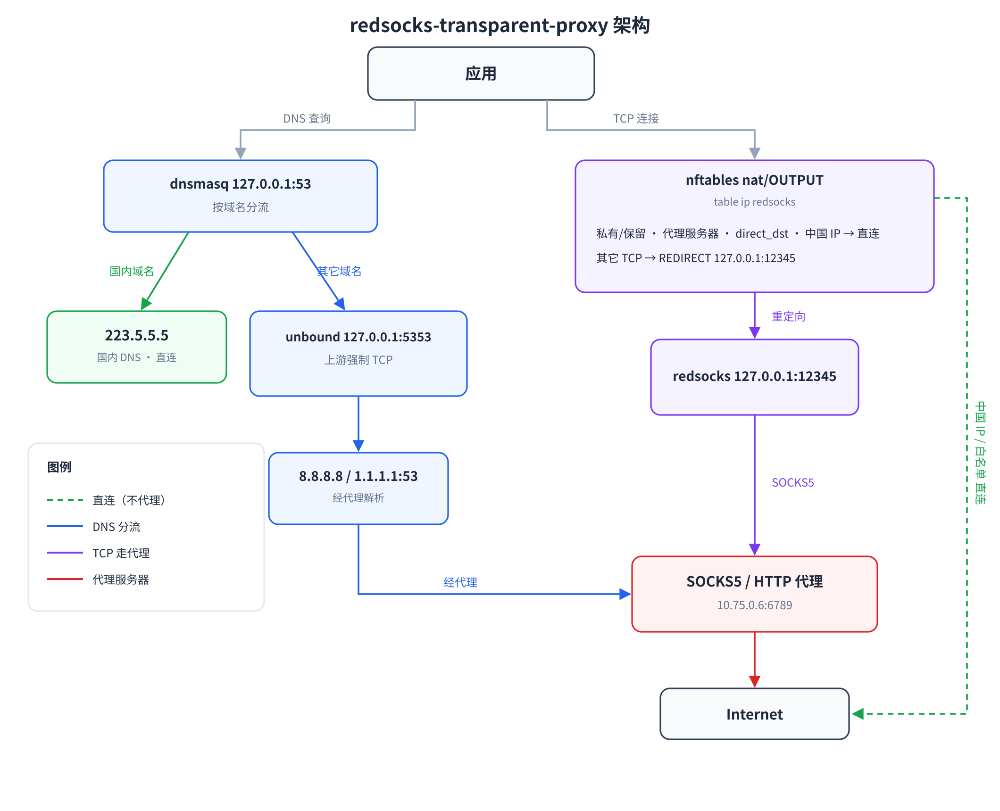

# redsocks-transparent-proxy

在**中国大陆的 Linux 服务器**上做透明分流：非中国 IP 的 TCP 流量经 SOCKS5/HTTP 代理出去，
中国 IP 直连，DNS 按域名分流以规避污染。基于 `redsocks` + `nftables` + `dnsmasq` + `unbound`，
**纯内核转发，应用无需任何配置**。

[](https://github.com/chenxianlong/redsocks-transparent-proxy)




## 它解决什么问题

- **国外站点**（Google / GitHub / YouTube / Wikipedia…）→ 经代理访问
- **国内站点**（百度 / 淘宝…）→ 直连，走国内 CDN，几乎零开销
- **DNS 污染** → 国内域名走国内 DNS 直连，国外域名经代理用 **TCP** 解析
- **不想改应用** → 内核重定向，连不读代理环境变量的程序也自动生效

## 工作原理

```
应用
 ├─ DNS → 127.0.0.1:53 (dnsmasq)
 │         ├─ 中国域名(11万条 + .cn) ──→ 223.5.5.5（UDP 直连）
 │         └─ 其它域名 ──→ 127.0.0.1:5353 (unbound)
 │                              └─ 上游 TCP 8.8.8.8 / 1.1.1.1:53（经代理）
 └─ TCP
       ▼
   nftables (table ip redsocks, nat/OUTPUT)
     ├─ 私有/保留地址、代理服务器、直连白名单、中国 IP 段 → RETURN（直连）
     └─ 其它 TCP → REDIRECT 127.0.0.1:12345 → redsocks → SOCKS5/HTTP 代理
```

## 快速开始

```bash
git clone https://github.com/chenxianlong/redsocks-transparent-proxy
sudo bash redsocks-transparent-proxy/scripts/install.sh \
    --proxy HOST:PORT --type http-connect
```

一行安装（无需 clone）：

```bash
curl -fsSL https://raw.githubusercontent.com/chenxianlong/redsocks-transparent-proxy/main/install.sh \
  | sudo bash -s -- --proxy HOST:PORT
```

支持 **Debian/Ubuntu** 与 **RHEL / CentOS / Rocky / Alma**，脚本会自动识别发行版。

## 验证

```bash
# 透明链路（强制绕过环境变量代理）
curl --noproxy '*' -s -o /dev/null -w '%{http_code} %{time_total}s\n' https://www.google.com
curl --noproxy '*' -s -o /dev/null -w '%{http_code} %{time_total}s\n' https://www.baidu.com

# DNS 分流
dig +short @127.0.0.1 www.google.com   # 真实 IP（未被污染）
```

## 文档导航

<div class="grid cards" markdown>

-   :material-blog-outline:{ .lg .middle } **博客：移植到 Rocky Linux 10**

    ---

    从「RHEL 没有 redsocks 包」到「代理返回 200 却卡死」，一次踩穿三个坑的完整排查记录。

    [:octicons-arrow-right-24: 阅读](blog-rhel-transparent-proxy.md)

-   :material-server-network:{ .lg .middle } **平台支持**

    ---

    发行版矩阵、redsocks 编译、SELinux 端口标签、unbound 目录差异与手工部署步骤。

    [:octicons-arrow-right-24: 查看](platform-support.md)

-   :material-speedometer:{ .lg .middle } **性能测试**

    ---

    吞吐 / CPU / DNS 延迟实测数据与复现方法。

    [:octicons-arrow-right-24: 查看](performance.md)

</div>

## 仓库

- 源码与安装脚本：<https://github.com/chenxianlong/redsocks-transparent-proxy>
- 问题反馈：<https://github.com/chenxianlong/redsocks-transparent-proxy/issues>
